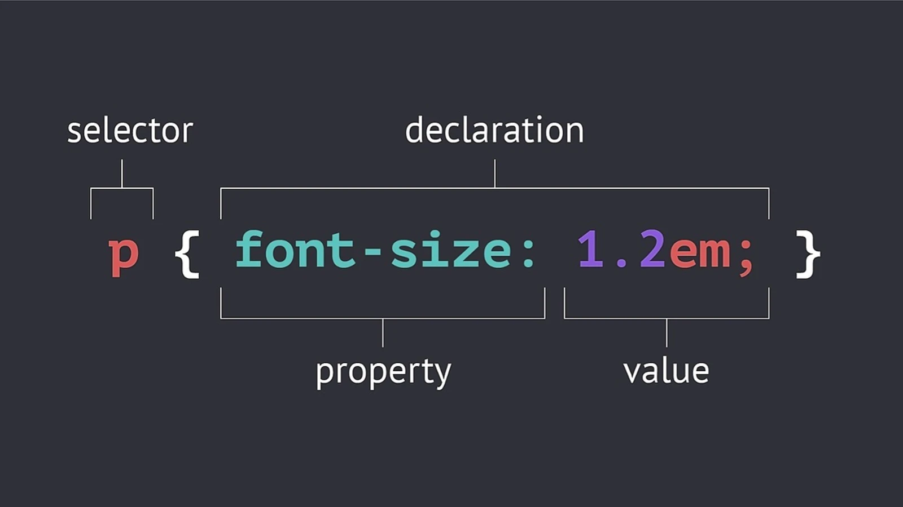

# Lesson 2: Introduction to CSS

CSS - Cascading Style Sheets
CSS Describes the visual style and presentation of the content written in HTML
CSS consists of lots of properties that are used to format the content; eg properties about the font,text, spacing, layout etc
CSS has a selector, Declaration/Style (Property and value)

## css rule

## Inline, Internal and External CSS

There are 3 places where we write our css;

-   Inline CSS
-   Internal CSS
-   External CSS

### Inline CSS

This is a way of writing the CSS inside of the elements using the style attribute

-   Inline styles should never be used (No separation of concerns)

### Internal CSS

This is a way of writing the CSS inside the head ealement, using the style element

-   This is incase of alot of CSS code (No separation of CSS code from HTML)

### External CSS

Most preferred

-   You use a separate css file (eg. style.css)
-   We link the css file to html using the _link_ element, in the head element
-   The link tag has the rel, and href properties (attributies)
    -   rel property specifies that it's a stylesheet
    -   href property specifies the path

## Styling text with css (6 Properties)

_font-size_ - specifies the size of the text. By default, font-size is 16px
_font-family_ - specifies different fonts for the text
_text-transfer_ - Turns the text uppercase, or, lowercase or capitalised etc
_font-style_ - turns the text italic etc
_line-height_ - specifies space between lines (no units). By default, line-height is 1
_text-align_ - Aligns the text left, right or center (with reference to the parent element)
_font-weight_ - Makes the text bold

## Combining selectors

Combine selectors with repeated properties and values

### List selector

-   Create a list of selectors and apply the repeated properties
-   We use commas to create a list of selectors e,g h1, h2, h3, h4

### Descendant selector

e.g footer p - selects all the p elements that are inside the footer element

-   To avoid errors (confusion) with other elements, you can make a descendant inside another descendant e. article header p

## Class and ID Selectors

Instead of descendant selectors, its better to give elements names and use their names to select them in css

To select elements;
id - use #
class - use .

-   We are not allowed to repeat id names (We can only use each id name only once)
-   If we need to reuse a name multiple times, then we have to use classes

## Other css styles

_list-style_ - Removes bullets on lists

## Note

In the real world we don't use ids. We only use classes because by using classes we are prepared for the future
Just incase we want to add another related item in the future, we can easily style it with the same css style.
Making the code ready for potential changes

## Working With Colors

**Ways of representing colors**
The RGB Model: Here every color can be represented by a combination of Red, Green and Blue colors.
We give each of the above 3 colors any value between 0 and 255 hence giving a total of 16.8 million colors

Two Ways of representing colors using the RGB Model;

1. RGB/RGBA Notation: e.g rgb(0, 255, 255), rgb(244, 179, 63),rgba(0, 255, 255, 0.3) (RGB with transparency (alpha))
2. HexaDecimal Notation (More used in css): Here we use a scale from 0 to ff. ff is the same as 255 in hexadecimal scale.
   e.g #00ffff. Shorthand is always used when all the colors are identical pairs #0ff

We always use a color picker to generate code.

-   In practice we usually use the hexadecimal notation and when we want transparency, we use the rgba notation

### Shades of Greys

-   These are a special kind of colors.
-   When colors in all the 3 channels are the same, we get the grey color. e.g rgb(0,0,0) or #000, rgb(69, 69, 69) or #444
-   There are 256 grey colors to choose from.
