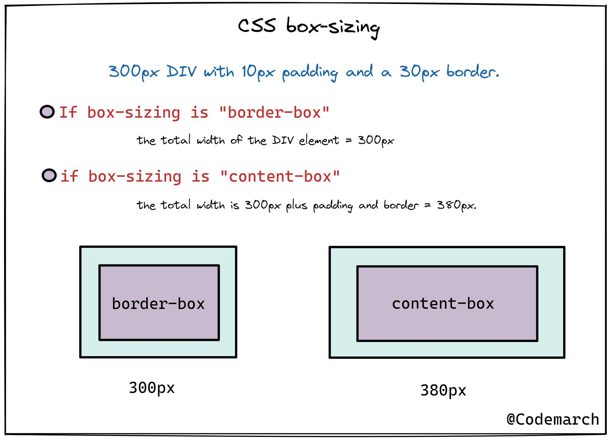

# Lesson 3: Layouts: Floats, Flexbox and CSS Grid

Layout is the way text, images and other content are placed and arranged on a webpage (instead of having them one after another; normal flow)
Layout gives the page a visual structure and into the structure we place the content

## Types of layouts

-   Page Layout: Laying out elements (big pieces - components) inside of a web page
-   Component Layout: Laying out smaller components inside of the big pieces (components)

## 3 Ways of Building Layouts

1. Float Layouts (old way of building layouts) - using the float css property
2. Flexbox (one of the modern ways of building layouts) - Its perfect for building one dimensional layouts (a layout with just a row) - Perfect for component layouts
3. CSS Grid (one of the modern ways of building layouts) - For laying out elements in 2-dimensional grid. Perfect for page layouts and complex components

## Using Floats

Using css property: float (left, right or none)
The selected element, all other elements float around it

### Normal Flow

-   This is the default positioning of elements on our page
-   We can achieve this value by using css _position: relative_
-   Element is "in flow"
-   Elements are laid out according to their order in the HTML source code

### Absolute Positioning

-   This allows us to absolutely position our elements any where on the page
-   We can achieve this value by using css _position: absolute_
-   Element is removed from the normal flow: "out of flow"
-   No impact on surrounding elements. It might overlap them
-   We use top, bottom, left, right property to offset the element from its relatively positioned container
-   The relative element must be a parent container
-   By default, the relative container is the viewport

### Floats

-   Element is removed from the normal flow: "out of flow"
-   Text and inline elements will wrap around the floated element
-   The container will not adjust its height to the element
-   css property;
    float: left
    float: right

## Clearing Floats

Since the height of the container element of floated item collapses, we need to clear floats
We have to add another element at the container element and clear the floats from there
We use the _clear_ css property (value both for all left and right floats)

To prevent having empty divs; use the clear fix hack
Add a clearfix class on the element with a collapsed height and use pseudo elements clearfix::after then clear: both

## box-sizing: border-box

border-box changes the default model of box model, the element takes the defined width and height of the element. Instead of adding width or height, and padding

