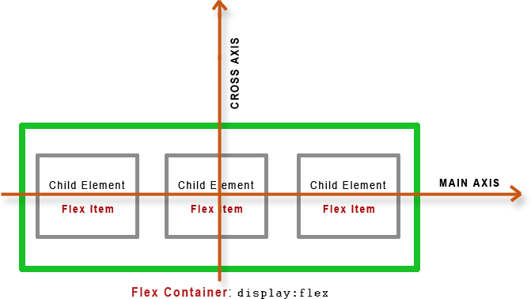

# Lesson 3: Layouts: Floats, Flexbox and CSS Grid

Layout is the way text, images and other content are placed and arranged on a webpage (instead of having them one after another; normal flow)
Layout gives the page a visual structure and into the structure we place the content

## Types of layouts

-   Page Layout: Laying out elements (big pieces - components) inside of a web page
-   Component Layout: Laying out smaller components inside of the big pieces (components)

## 3 Ways of Building Layouts

1. Float Layouts (old way of building layouts) - using the float css property
2. Flexbox (one of the modern ways of building layouts) - Its perfect for building one dimensional layouts (a layout with just a row) - Perfect for component layouts
3. CSS Grid (one of the modern ways of building layouts) - For laying out elements in 2-dimensional grid. Perfect for page layouts and complex components

## Using Floats

Using css property: float (left, right or none)
The selected element, all other elements float around it

### Normal Flow

-   This is the default positioning of elements on our page
-   We can achieve this value by using css _position: relative_
-   Element is "in flow"
-   Elements are laid out according to their order in the HTML source code

### Absolute Positioning

-   This allows us to absolutely position our elements any where on the page
-   We can achieve this value by using css _position: absolute_
-   Element is removed from the normal flow: "out of flow"
-   No impact on surrounding elements. It might overlap them
-   We use top, bottom, left, right property to offset the element from its relatively positioned container
-   The relative element must be a parent container
-   By default, the relative container is the viewport

### Floats

-   Element is removed from the normal flow: "out of flow"
-   Text and inline elements will wrap around the floated element
-   The container will not adjust its height to the element
-   css property;
    float: left
    float: right

### Clearing Floats

Since the height of the container element of floated item collapses, we need to clear floats
We have to add another element at the container element and clear the floats from there
We use the _clear_ css property (value both for all left and right floats)

To prevent having empty divs; use the clear fix hack
Add a clearfix class on the element with a collapsed height and use pseudo elements clearfix::after then clear: both

### box-sizing: border-box

-   border-box changes the default model of box model, the element takes the defined width and height of the element. Instead of adding width or height, and padding
-   The default behavior is content-box
-   Advised to put it on all the elements(\*)

## Flexbox Introduction

Use a css property _display: flex_ on a container with child elements. Makes all elements side by side.
The elements are flex items because they are the child elements of the flex container

### Vertical Alignment

-   Center elements vertically - _align-items: center_
-   Put elements at very start (top) - _align-items: flex-start_
-   Put elements at bottom - _align-items: flex-end_
-   By default - _align-items: stretch_ (all elements stretch as tall as the tallest element)

### Horizontal Alignment

-   Center elements horizontally - _justify-content: center_
-   Distribute space evenly between elements - _justify-content: space-between_

## A Flexbox Overview

What is Flexbox? Flexbox is a set of related CSS Properties for building 1 dimensional layouts
Helpful for aligning items one another inside a container both horizontally and vertically
Flexbox solves common problems such as vertical centering and creating equal height columns
Flexbox is perfect for replacing floats, allowing us to write fewer and cleaner HTML and CSS code

### Flexbox Terminology

Flex Container: The element on which you want to use flexbox (Set display: flex)
Flex Items: The child elements of the flex container element
Main Axis: The direction on which the flex items are laid out
Cross Axis: The perpendicular axis of the main axis

### All CSS Properties for flex box (Both for flex container and Flex Item)

**Flex Container**

1. gap: 0 - To create space between items, without using margins
2. justify-content: flex-start | flex-end | center | space-between | space-around- To align items along main axis (Horizontally by default)
3. align-items: stretch | flex-start | flex-end | center | baseline - To align items along across axis (vertically by default)
4. flex-direction: row | row-reverse | column | column-reverse - To define which is the main axis
5. flex-wrap: nowrap | wrap | wrap-reverse - To allow items wrap into a new line if they are too large
6. align-content: stretch | flex-start | flex-end | center | space-between | space-around - Only applies when there are multiple lines (flex-wrap: wrap)

**Flex Items**

1. align-self: auto | stretch | flex-start | flex-end | center | baseline - To overwrite align-items for individual flex items
2. flex-grow: 0 - To allow elements to grow (0 means no, 1+ means yes) (1 Allows the elements to grow as they can in the container, they will have the same size)
3. flex-shrink: 1 - To allow elements to shrink (0 means no, 1+ means yes) (1 allows the content fit in the container)
4. flex-basis: auto - To define an item width, instead of width property
5. flex: 0 1 auto - Recommended, shorthand for flex-grow, -shrink, -basis
6. Order: 0 - Controls order of items (-1 makes the item first, 1 makes it last - specify a number greater or less than the other. By default, order is 0 for all elements)

-   The two properties flex-direction and flex-wrap are used so often together that the shorthand property flex-flow was created to combine them. For example, you can use flex-flow: row wrap to set rows and wrap them.
-   flex-grow: 1 on only one element, allows only that one element grow
-   flex-grow: 2 on only one element, doubles the grow in comparison to other elements
-   For flex-shrink, flex-grow and flex-basis, always use the shorthand property
-   for automatic width and spacing; flex: 1

## CSS Grid Introduction

CSS Grid is the most modern way of building layouts & its the most complete one and the easiest

-   In CSS Grid, we have Grid Container and Grid Items; similar logic to flex container and flex items
-   We define our 2-Dimensional layout; columns and rows
-   grid-template-columns - number of columns and size
-   grid-template-rows - number of rows and size
-   column-gap - space between columns
-   row-gap - space between rows
